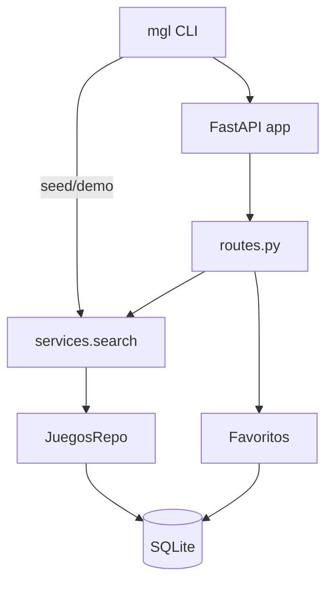

# MyGameList — PRAC2 MVP

**Stack:** Python · FastAPI · SQLModel/SQLite · Typer · Pytest · Black/Ruff · pdoc

## Instalación rápida
```bash
python -m venv .venv
# Windows: .venv\Scripts\activate
source .venv/bin/activate
pip install -e .[dev]
```

## Semilla y API
```bash
python -m mgl.cli seed data/seed/games.csv
uvicorn mgl.api:app --reload
# En otra terminal:
curl "http://127.0.0.1:8000/juegos?q=zelda"
```

## CLI demo
```bash
python -m mgl.cli demo
```

## Tests y cobertura
```bash
pytest --cov=src/mgl --cov-report=term-missing
```

## Docs (pdoc)
```bash
pdoc -o docs/ src/mgl
# Abrir docs/index.html
```

## Diagrama (mermaid)


## Roadmap PRAC3
- Reseñas de usuarios con validaciones y ordenación por score.
- Paginación/ordenación en `/juegos`.
- Autenticación básica (simulada o OAuth local).
